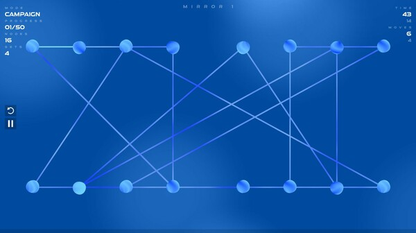
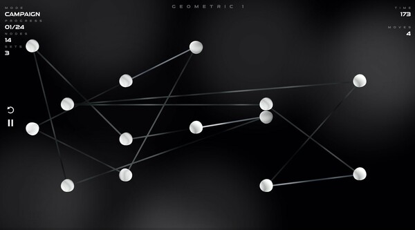
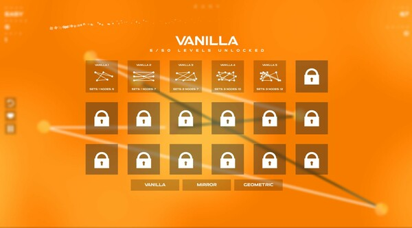
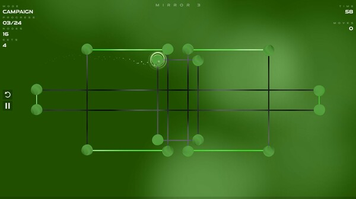

# Untangle

## Preview
Untangle is a simple puzzle game that requires you to swap orb positions in order to untangle the lines.

## Notice
The code may not be copied or used for ANY purposes. It was only uploaded for temporary display.
